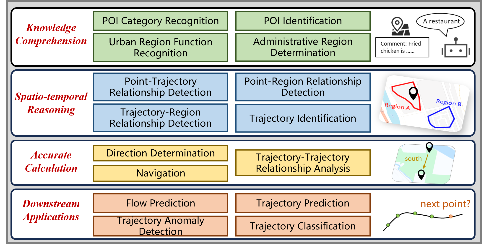

<h1 align="center">STBench: Assessing the Ability of Large Language Models in Spatio-Temporal Analysis</h1>

<p align="center">
Institute of Computing Technology (ICT), Chinese Academy of Sciences (CAS)<br/>
</p>
<p align="center">
   🤗 <a href="https://huggingface.co/datasets/LwbXc/STBench" target="_blank">Hugging Face Dataset</a> •   📃 <a href="https://arxiv.org/abs/2406.19065" target="_blank">Paper</a> 
</p>



STBench is a benchmark to evaluate the ability of large language models in spatio-temporal analysis. This benchmark consists of 15 distinct tasks and over 70,000 question-answer pairs, covering four dimensions: knowledge comprehension, spatio-temporal reasoning, accurate computation and downstream applications.

All data samples in STBench are in the form of text completion. An instance is as follows:
```text
Question: Below is the coordinate information and related comments of a point of interest: ... Please answer the category of this point of interest.
Options: (1) xxxx, (2) xxxx, (3) xxxx, ...
Please answer one option.
Answer: The answer is option (
```
The model is expected to complete the text, *i.e.*, it should generate an option number. Therefore, to benchmark a model with STBench, it is necessary to use a text completion API rather than a chat completion API. For chatting models that only provide chat completion API, we suggest instructing the models to complete the text through the system prompt:
```json
[{"role": "system", "content": "you are a helpful text completion assistant. Please continue writing the text entered by the human."}, {"role": "human", "content": "Question: Below is the coordinate information and related comments of a point of interest: ... Please answer the category of this point of interest.\nOptions: (1) xxxx, (2) xxxx, (3) xxxx, ...\nPlease answer one option.\nAnswer: The answer is option ("}]
```

## Quick Start
We have benchmarked 13 distinct large language models and here we provide a simple guide to reproduce our experiments.

1. Dependency Installation

   Run the following command to install dependencies:
   ```bash
   pip install -r requirements.txt
   ```
3. Model Downloading

   Our experiments about open-source models are based on [modelscope](https://github.com/modelscope/modelscope) and these open-source models can be downloaded by following command:
   ```bash
   cd code
   python downloads_llms.py
   ```

4. Basic Prompt

   Run the following command to benchmark all models through 15 tasks:
   ```bash
   python basic_prompting.py
   ``` 

6. In-Context Learning

   Run the following command to evaluate the performance of all models with in-context learning:
   ```bash
   python icl_prompting.py
   ``` 

7. Chain-of-Thought Prompting

   To conduct experiments with chain-of-thought prompting for all models, run the following command:
   ```bash
   python cot_prompting.py
   ```

8. Fine-tuning

   Run the following command to fine-tune the model and evaluate the fine-tuned model:
   ```bash
   python fine_tuning.py
   ```

## Detailed Usage
This repository is organized as follows:
```text
Project
  |—— LICENSE
  |—— overview.png
  |—— README.md
  |—— requirements.txt
  |—— datasets                  # all datasets can be found in this directory
      |—— basic                 # the main datasets of STBench, consists of over 60,000 QA pairs
      |—— icl                   # two samples for each task to perform two-shot prompting
      |—— cot                   # two samples containing reasoning for each task to perform CoT prompting
      |—— sft                   # training datasets and validation datasets for fine-tuning
  |—— code
      |—— model_inference       # calling the API of each large language model
      |—— model_finetuning      # fine-tuning code
      |—— download_llms.py      # downloading open-source models
      |—— basic_prompting.py    # running experiments with basic prompting
      |—— icl_prompting.py      # running experiments with icl prompting
      |—— cot_prompting.py      # running experiments with cot prompting
      |—— fine_tuning.py        # running experiments with fine-tuning
      |—— result_parser.py      # code for identifying the final answer of the model
      |—— config.py             # a declaration of some configuration such as the file path for each task      
```
1. To benchmark a new model, namely **NEW_MODEL**

   a. Write your code for calling the API of this model in `code/model_inference/new_model.py`, and modify `code/model_inference/__init__.py` accordingly.

   b. Add the model to the model list in `code/basic_prompting.py` 

3. To include a new dataset, namely `new_dataset.jsonl`, for a task **NEW_TASK**

   a. Put your datasets here: `dataset/basic/new_dataset.jsonl`

   b. Modify `code/result_parser.py` and implement your function `new_task_parser()` to parse the results from the output of the LLMs

   c. Modify `code/config.py` to specify the mapping from **NEW_TASK** to the dataset path `dataset/basic/new_dataset.jsonl` and the mapping from **NEW_TASK** to the result parser `new_task_parser()`

   d. Add the task to the task list in `code/basic_prompting.py` 
   
## Experimental Results

+ Accuracy and MAE are shown in the following table:

<table>
    <tr>
        <td align="center"></td>
        <td align="center" colspan="4">Knowledge Comprehension</td>
        <td align="center" colspan="4">Spatio-temporal Reasoning</td>
        <td align="center" colspan="2">Accurate Computation</td>
        <td align="center" colspan="3">Downstream Applications</td>
    </tr>
    <tr>
        <td align="center"></td><td align="center">PCR</td><td align="center">PI</td><td align="center">URFR</td><td align="center">ARD</td><td align="center">PTRD</td><td align="center">PRRD</td><td align="center">TRRD</td><td align="center">TI</td><td align="center">DD</td><td align="center">NAV</td><td align="center">TTRA</td><td align="center">FP</td><td align="center">TAD</td><td align="center">TC</td><td align="center">TP</td>
    </tr>
    <tr>
        <td align="center"> ChatGPT </td><td align="center"><span style="text-decoration: underline;"> 0.7926 </span></td><td align="center"> 0.5864 </td><td align="center"><span style="text-decoration: underline;"> 0.3978 </span></td><td align="center"><span style="text-decoration: underline;"> 0.8358 </span></td><td align="center"><b> 0.7525 </b></td><td align="center"><b> 0.9240 </b></td><td align="center"> 0.0258 </td><td align="center"> 0.3342 </td><td align="center"> 0.1698 </td><td align="center"><span style="text-decoration: underline;"> 0.4384 </span></td><td align="center"> 0.1048 </td><td align="center"> 37.33 </td><td align="center"><span style="text-decoration: underline;"> 0.5382 </span></td><td align="center"><b> 0.4475 </b></td><td align="center"> -
    </tr>
    <tr>
        <td align="center">GPT-4o </td><td align="center"><b> 0.9588 </b></td><td align="center"><b> 0.7268 </b></td><td align="center"><b> 0.6026 </b></td><td align="center"><b> 0.9656 </b></td><td align="center"> - </td><td align="center"><span style="text-decoration: underline;"> 0.9188 </span></td><td align="center"> 0.1102 </td><td align="center"> 0.4416 </td><td align="center"><b> 0.5434 </b><td align="center"><b> 0.7552 </b></td></td><td align="center"><b> 0.3404 </b><td align="center"> 43.25 </td></td><td align="center"><b> 0.6016 </b></td><td align="center"> - </td><td align="center"> - </td>
    </tr>
    <tr>
        <td align="center"> ChatGLM2 </td><td align="center"> 0.2938 </td><td align="center"> 0.5004 </td><td align="center"> 0.2661 </td><td align="center"> 0.2176 </td><td align="center"> 0.2036 </td><td align="center"> 0.5216 </td><td align="center"><b> 0.2790 </b></td><td align="center"> 0.5000 </td><td align="center"> 0.1182 </td><td align="center"> 0.2924 </td><td align="center"> 0.1992 </td><td align="center"> 63.72 </td><td align="center"> 0.5000 </td><td align="center"> 0.3333 </td><td align="center"> 231.2 </td>
    </tr>
    <tr>
        <td align="center"> ChatGLM3 </td><td align="center"> 0.4342 </td><td align="center"> 0.5272 </td><td align="center"> 0.2704 </td><td align="center"> 0.2872 </td><td align="center"> 0.3058 </td><td align="center"> 0.8244 </td><td align="center"> 0.1978 </td><td align="center"><span style="text-decoration: underline;"> 0.6842 </span></td><td align="center"> 0.1156 </td><td align="center"> 0.2576 </td><td align="center"> 0.1828 </td><td align="center"> 59.24 </td><td align="center"> 0.5000 </td><td align="center"> 0.3111 </td><td align="center"> 224.5 </td>
    </tr>
    <tr>
        <td align="center"> Phi-2 </td><td align="center"> - </td><td align="center"> 0.5267 </td><td align="center"> - </td><td align="center"> 0.2988 </td><td align="center"> - </td><td align="center"> - </td><td align="center"> - </td><td align="center"> 0.5000 </td><td align="center"> 0.1182 </td><td align="center"> 0.2912 </td><td align="center"> 0.0658 </td><td align="center"><span style="text-decoration: underline;"> 34.82 </span></td><td align="center"> 0.5000 </td><td align="center"> 0.3333 </td><td align="center"> 206.9 </td>
    </tr>
    <tr>
        <td align="center"> Llama-2-7B </td><td align="center"> 0.2146 </td><td align="center"> 0.4790 </td><td align="center"> 0.2105 </td><td align="center"> 0.2198 </td><td align="center"> 0.2802 </td><td align="center"> 0.6606 </td><td align="center"> 0.2034 </td><td align="center"> 0.5486 </td><td align="center"> 0.1256 </td><td align="center"> 0.2774 </td><td align="center"> 0.2062 </td><td align="center"> 53.79 </td><td align="center"> 0.5098</td><td align="center"> 0.3333 </td><td align="center"> 189.3 </td>
    </tr>
    <tr>
        <td align="center"> Vicuna-7B </td><td align="center"> 0.3858 </td><td align="center"> 0.5836 </td><td align="center"> 0.2063 </td><td align="center"> 0.2212 </td><td align="center"> 0.3470 </td><td align="center"> 0.7080 </td><td align="center"> 0.1968 </td><td align="center"> 0.5000 </td><td align="center"> 0.1106 </td><td align="center"> 0.2588 </td><td align="center"> 0.1728 </td><td align="center"> 48.19 </td><td align="center"> 0.5000 </td><td align="center"> 0.2558 </td><td align="center"> 188.1</td>
    </tr>
    <tr>
        <td align="center"> Gemma-2B </td><td align="center"> 0.2116 </td><td align="center"> 0.5000 </td><td align="center"> 0.1989 </td><td align="center"> 0.1938 </td><td align="center"> 0.4688 </td><td align="center"> 0.5744 </td><td align="center"> 0.2014 </td><td align="center"> 0.5000 </td><td align="center"><span style="text-decoration: underline;"> 0.1972 </span></td><td align="center"> 0.2592 </td><td align="center"> 0.2038 </td><td align="center"> 41.79 </td><td align="center"> 0.5000 </td><td align="center"> 0.3333 </td><td align="center"> 207.7 </td>
    </tr>
    <tr>
        <td align="center"> Gemma-7B </td><td align="center"> 0.4462 </td><td align="center"> 0.5000 </td><td align="center"> 0.2258 </td><td align="center"> 0.2652 </td><td align="center"> 0.3782 </td><td align="center"> 0.9044 </td><td align="center"> 0.1992 </td><td align="center"> 0.5000 </td><td align="center"> 0.1182 </td><td align="center"> 0.3886 </td><td align="center"> 0.1426 </td><td align="center"><b> 31.85 </b></td><td align="center"> 0.5000 </td><td align="center"> 0.3333 </td><td align="center"><b> 139.4</b></td>
    </tr>
    <tr>
        <td align="center"> DeepSeek-7B </td><td align="center"> 0.2160 </td><td align="center"> 0.4708 </td><td align="center"> 0.2071 </td><td align="center"> 0.1938 </td><td align="center"> 0.2142 </td><td align="center"> 0.6424 </td><td align="center"> 0.1173 </td><td align="center"> 0.4964 </td><td align="center"> 0.1972 </td><td align="center"> 0.3058 </td><td align="center"> 0.1646 </td><td align="center"> 56.89 </td><td align="center"> 0.5000 </td><td align="center"> 0.3333 </td><td align="center"> 220.8</td>
    </tr>
    <tr>
        <td align="center"> Falcon-7B </td><td align="center"> 0.1888 </td><td align="center"> 0.5112 </td><td align="center"> 0.1929 </td><td align="center"> 0.1928 </td><td align="center"> 0.1918 </td><td align="center"> 0.4222 </td><td align="center"><span style="text-decoration: underline;"> 0.2061 </span></td><td align="center"><b> 0.7072 </b></td><td align="center"> 0.1365 </td><td align="center"> 0.2610 </td><td align="center"> 0.2124 </td><td align="center"> 62.52 </td><td align="center"> 0.5000 </td><td align="center"> 0.3309 </td><td align="center"> 3572.8 </td>
    </tr>
    <tr>
        <td align="center"> Mistral-7B </td><td align="center"> 0.3526 </td><td align="center"> 0.4918 </td><td align="center"> 0.2168 </td><td align="center"> 0.3014 </td><td align="center"> 0.4476 </td><td align="center"> 0.7098 </td><td align="center"> 0.0702 </td><td align="center"> 0.4376 </td><td align="center"> 0.1182 </td><td align="center"> 0.3006 </td><td align="center"> 0.1094 </td><td align="center"> 42.59 </td><td align="center"> 0.5000 </td><td align="center"> 0.3333 </td><td align="center"> 156.8 </td>
    </tr>
    <tr>
        <td align="center"> Qwen-7B </td><td align="center"> 0.2504 </td><td align="center"><span style="text-decoration: underline;"> 0.6795 </span></td><td align="center"> 0.2569 </td><td align="center"> 0.2282 </td><td align="center"> 0.2272 </td><td align="center"> 0.5762 </td><td align="center"> 0.1661 </td><td align="center"> 0.4787 </td><td align="center"> 0.1324 </td><td align="center"> 0.3106 </td><td align="center"><span style="text-decoration: underline;"> 0.2424 </span></td><td align="center"> 53.49 </td><td align="center"> 0.5049 </td><td align="center"><span style="text-decoration: underline;"> 0.3477 </span></td><td align="center"> 205.2 </td>
    </tr>
    <tr>
        <td align="center"> Yi-6B </td><td align="center"> 0.3576 </td><td align="center"> 0.5052 </td><td align="center"> 0.2149 </td><td align="center"> 0.1880 </td><td align="center"><span style="text-decoration: underline;"> 0.5536 </span></td><td align="center"> 0.8264 </td><td align="center"> 0.1979 </td><td align="center"> 0.5722 </td><td align="center"> 0.1284 </td><td align="center"> 0.3336 </td><td align="center"> 0.2214 </td><td align="center"> 52.03 </td><td align="center"> 0.5000 </td><td align="center"> 0.3333 </td><td align="center"><span style="text-decoration: underline;"> 156.2 </span></td>
    </tr>
</table>
