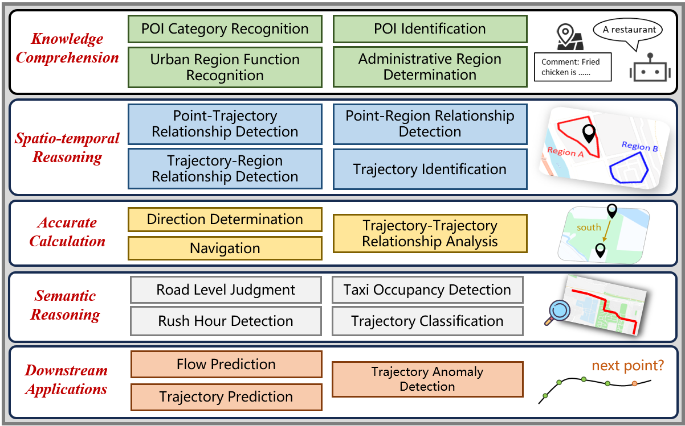

# STBench: Assessing the Ability of Large Language Models in Spatio-Temporal Analysis



STbench is a benchmark to evaluate the ability of large language models in spatio-temporal analysis. This benchmark consists of 13 distinct tasks and over 60,000 question-answer pairs, covering four dimensions: knowledge comprehension, spatio-temporal reasoning, accurate computation and downstream applications.

All data samples in STbench are in the form of text completion. An instance is as follows:
```text
Question: Below is the coordinate information and related comments of a point of interest: ... Please answer the category of this point of interest.
Options: (1) xxxx, (2) xxxx, (3) xxxx, ...
Please answer one option.
Answer: The answer is option (
```
The model is expected to complete the text, *i.e.*, it should generate an option number. Therefore, to benchmark a model with STBench, it is necessary to use a text completion API rather than a chat completion API. For chatting models that only provide chat completion API, we suggest instructing the models to complete the text through the system prompt:
```json
[{"role": "system", "content": "you are a helpful text completion assistant. Please continue writing the text entered by the human."}, {"role": "human", "content": "Question: Below is the coordinate information and related comments of a point of interest: ... Please answer the category of this point of interest.\nOptions: (1) xxxx, (2) xxxx, (3) xxxx, ...\nPlease answer one option.\nAnswer: The answer is option ("}]
```

## Quick Start
We have benchmarked 13 distinct large language models and here we provide a simple guide to reproduce our experiments.

1. Dependency Installation
 Run the following command to install dependencies:
   ```bash
   pip install -r requirements.txt
   ```
2. Model Downloading
Our experiments about open-source models are based on [modelscope](https://github.com/modelscope/modelscope) and the models can be downloaded by following command:
    ```bash
    cd code/open_source
    python downloads_llms.py
    ```
3. Basic Prompt
Run the following command to benchmark all models through 13 tasks:
    ```bash
    python basic_prompting.py
    ``` 

4. In-Context Learning
Run the following command to evaluate the performance of all models with in-context learning:
    ```bash
    python icl_prompting.py
    ``` 

5. Chain-of-Thought Prompting
To conduct experiments with chain-of-thought prompting for all models, run the following command:
    ```bash
    python cot_prompting.py
    ```

6. Fine-tuning
Run the following command to fine-tune the model and evaluate the fine-tuned model:
    ```bash
    python fine_tuning.py
    ```

## Detailed Usage
The directory of this repository is organized as follows:
```text
Project
  |—— LICENSE
  |—— overview.png
  |—— README.md
  |—— requirements.txt
  |—— datasets                  # all datasets can be found in this directory
      |—— basic                 # the main datasets of STBench, consists of over 60,000 QA pairs
      |—— icl                   # two samples for each task to perform two-shot prompting
      |—— cot                   # two samples containing reasoning for each task to perform CoT prompting
      |—— sft                   # training datasets and validation datasets for fine-tuning
  |—— code
      |—— model_inference       # calling the API of each large language model
      |—— model_finetuning      # fine-tuning code
      |—— download_llms.py      # downloading open-source models
      |—— basic_prompting.py    # run experiments with basic prompting
      |—— icl_prompting.py      # run experiments with icl prompting
      |—— cot_prompting.py      # run experiments with cot prompting
      |—— fine_tuning.py        # run experiments with fine-tuning
      |—— result_parser.py      # code for identifying the final answer of the model
      |—— config.py             # A declaration of some configuration such as the file path for each task      
```
1. To benchmark a new model, namely **NEW_MODEL**

   a. Write your code for calling the API of this model in `code/model_inference/new_model.py`, and modify `code/model_inference/__init__.py` accordingly.

   b. Add the model to the model list in `code/basic_prompting.py` 

3. To include a new dataset, namely `new_dataset.jsonl`, for a task **NEW_TASK**

   a. Put your datasets here: `dataset/basic/new_dataset.jsonl`

   b. Modify `code/result_parser.py` and implement your function `new_task_parser()` to parse the results from the output of the LLMs

   c. Modify `code/config.py` to specify the mapping of **NEW_TASK** to the dataset path `dataset/basic/new_dataset.jsonl` and the mapping of **NEW_TASK** to the result parser `new_task_parser()`

   d. Add the task to the task list in `code/basic_prompting.py` 
   
